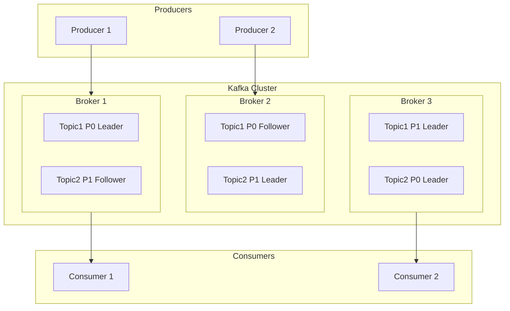

# Kafka Architecture

## Learning Objectives
- Understand Kafka's distributed architecture
- Explain partitions, replicas, and their role in scalability and fault tolerance
- Differentiate between ZooKeeper and KRaft modes
- Describe how Kafka achieves high availability

## Why This Matters

Understanding Kafka's architecture is essential for:
- Designing topics with appropriate partition counts
- Configuring replication for fault tolerance
- Troubleshooting performance issues
- Making informed decisions about deployment

This knowledge directly supports our Weekly Epic by ensuring you can build **reliable, scalable event streaming systems**.

## The Concept

### High-Level Architecture

```
                    +---------------------------+
                    |      Kafka Cluster        |
                    |                           |
+----------+        |  +-------+  +-------+    |        +----------+
| Producer |------->|  |Broker1|  |Broker2|    |------->| Consumer |
+----------+        |  +-------+  +-------+    |        +----------+
                    |       +-------+          |
+----------+        |       |Broker3|          |        +----------+
| Producer |------->|       +-------+          |------->| Consumer |
+----------+        |                           |        +----------+
                    +---------------------------+
                                 |
                    +---------------------------+
                    |    ZooKeeper / KRaft      |
                    |   (Cluster Coordinator)   |
                    +---------------------------+
```

### Partitions: The Unit of Parallelism

A **partition** is a subset of a topic's data. Each topic is divided into one or more partitions.

**Why partitions matter:**
- **Parallelism**: Multiple consumers can read from different partitions simultaneously
- **Scalability**: Partitions can be spread across multiple brokers
- **Ordering**: Messages within a partition are strictly ordered

```
Topic: user-events (3 partitions)

+-------------------+     +-------------------+     +-------------------+
|   Partition 0     |     |   Partition 1     |     |   Partition 2     |
+-------------------+     +-------------------+     +-------------------+
| Offset 0: msg_a   |     | Offset 0: msg_d   |     | Offset 0: msg_g   |
| Offset 1: msg_b   |     | Offset 1: msg_e   |     | Offset 1: msg_h   |
| Offset 2: msg_c   |     | Offset 2: msg_f   |     | Offset 2: msg_i   |
+-------------------+     +-------------------+     +-------------------+
     (Broker 1)                (Broker 2)                (Broker 3)
```

**Key partition concepts:**

| Concept | Description |
|---------|-------------|
| **Offset** | Sequential ID for each message within a partition |
| **Partition Key** | Determines which partition receives a message |
| **Ordering Guarantee** | Only guaranteed within a single partition |

### Replication: Fault Tolerance

Each partition can have multiple **replicas** spread across different brokers. This ensures data survival if a broker fails.

**Replication terminology:**
- **Replication Factor**: Number of copies of each partition (e.g., 3)
- **Leader**: The replica that handles all reads/writes
- **Followers**: Replicas that copy data from the leader
- **ISR (In-Sync Replicas)**: Followers that are fully caught up with the leader

```
Topic: orders (Partition 0, Replication Factor = 3)

+------------------+     +------------------+     +------------------+
|     Broker 1     |     |     Broker 2     |     |     Broker 3     |
+------------------+     +------------------+     +------------------+
|   Partition 0    |     |   Partition 0    |     |   Partition 0    |
|    [LEADER]      |     |   [FOLLOWER]     |     |   [FOLLOWER]     |
+------------------+     +------------------+     +------------------+
        |                        ^                        ^
        |  Replication           |                        |
        +------------------------+------------------------+
```

**What happens when a leader fails?**
1. The Kafka cluster detects the failure
2. An in-sync follower is elected as the new leader
3. Producers and consumers automatically connect to the new leader
4. No data is lost (if the follower was in the ISR)

### ZooKeeper vs. KRaft

Kafka requires a **coordinator** to manage cluster metadata, elect leaders, and handle configuration. Historically, this was ZooKeeper. The newer approach is KRaft.

**ZooKeeper Mode (Legacy):**
- Separate ZooKeeper cluster required
- Stores cluster metadata externally
- Additional operational complexity
- Being phased out

**KRaft Mode (Modern):**
- Kafka manages its own metadata (no external dependencies)
- Simplified deployment and operations
- Better performance at scale
- Recommended for new deployments (Kafka 3.0+)

```
ZooKeeper Mode:                    KRaft Mode:
+----------------+                 +----------------+
| Kafka Cluster  |                 | Kafka Cluster  |
+-------+--------+                 +-------+--------+
        |                                  |
        v                          (Self-contained)
+----------------+
|   ZooKeeper    |
|    Cluster     |
+----------------+
```

### Broker Responsibilities

Each broker in a Kafka cluster handles:

1. **Storage**: Persisting messages to disk
2. **Serving Clients**: Handling producer/consumer requests
3. **Replication**: Copying data to/from other brokers
4. **Leader Election**: Participating in partition leader elections

### How Kafka Achieves High Availability

| Mechanism | How It Works |
|-----------|--------------|
| **Replication** | Multiple copies of data across brokers |
| **Leader Election** | Automatic failover when leaders fail |
| **ISR Tracking** | Only in-sync replicas can become leaders |
| **Acknowledgments** | Producers can wait for replica confirmations |

### Partition Assignment Strategy

When a producer sends a message:

1. **With Key**: Hash of key determines partition (consistent per key)
2. **Without Key**: Round-robin distribution across partitions

```python
# Messages with the same key always go to the same partition
producer.send("orders", key="customer-123", value="order-1")  # --> Partition 2
producer.send("orders", key="customer-123", value="order-2")  # --> Partition 2
producer.send("orders", key="customer-456", value="order-3")  # --> Partition 0

# Messages without keys are distributed round-robin
producer.send("logs", value="log entry 1")  # --> Partition 0
producer.send("logs", value="log entry 2")  # --> Partition 1
producer.send("logs", value="log entry 3")  # --> Partition 2
```

## Mermaid Diagram: Kafka Cluster Architecture



## Summary

- **Partitions** divide topics for parallelism and scalability
- **Replicas** provide fault tolerance by copying data across brokers
- **Leaders** handle all reads/writes; **followers** maintain copies
- **ZooKeeper** (legacy) and **KRaft** (modern) manage cluster coordination
- Kafka achieves high availability through replication, leader election, and ISR tracking
- Message partitioning can be controlled using keys for ordering guarantees

## Additional Resources

- [Kafka Architecture - Official Documentation](https://kafka.apache.org/documentation/#design)
- [Deep Dive into Kafka Replication - Confluent](https://developer.confluent.io/learn-kafka/apache-kafka/partitions/)
- [KRaft: Apache Kafka Without ZooKeeper](https://developer.confluent.io/learn/kraft/)
